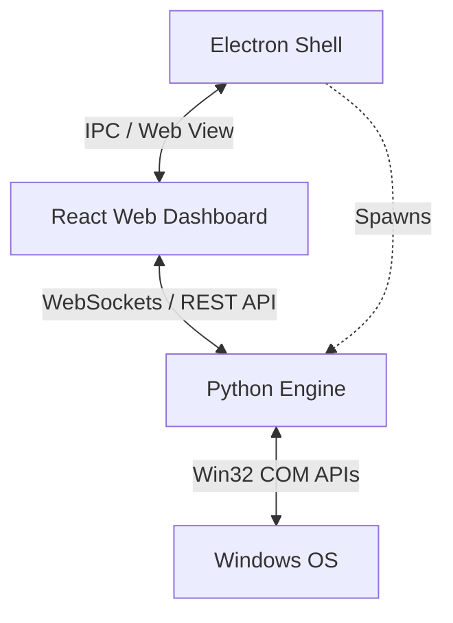

# Docksy

[](https://opensource.org/licenses/MIT)
[](https://microsoft.com/windows)

**Docksy** is a native Windows application designed for developers, power users, and professionals who manage multiple complex tasks, window layouts, and browser sessions daily. It automates workspace restoration so you spend zero minutes reorganizing your desktop when starting work or swapping contexts.

With Docksy, you can capture your entire workspace state—including window sizes, monitor placements, virtual desktops, and browser tabs—and restore it instantly with a single click.

---

## Key Features

- **Multi-Monitor Layouts**: Captures exact window coordinates and states (maximized, minimized, normal) across multiple monitors.
- **Windows Virtual Desktops**: Integrates with Windows 10 and 11 Virtual Desktops to place applications back on their respective virtual desktops.
- **Browser Tab Restoration**: Deeply integrates with major web browsers (Google Chrome, Microsoft Edge, Brave, etc.) to capture and restore active tabs and URLs.
- **App-Specific Contexts**: Automatically recognizes and restores specific directory paths for **Windows File Explorer** and workspaces for **VS Code**.
- **Automated Snapshots**: Features a daemon that can take automatic background snapshots of your workspace based on custom schedules.
- **Privacy & Speed**: Built local-first with zero external cloud dependencies. All workspace layout details are stored safely in a local database.

---

## System Architecture

Docksy's architecture consists of three interconnected layers:



1. **Frontend (React + Vite)**: A clean, sleek, high-contrast dashboard for managing workspaces, schedules, snapshots, and configuration settings.
2. **Desktop Shell (Electron)**: A native container that handles system tray integration, minimizes to the tray, manages startup registry options, and spawns the backend process.
3. **Core Engine (Python)**: A lightweight, low-level service that executes Win32 API bindings (via `ctypes`) and `pyvda` COM APIs to query and manipulate desktop windows, process cmdlines, virtual desktops, and active monitors.

---

## Tech Stack

- **Core**: HTML5, TypeScript, Python 3
- **Frontend**: React, Zustand, Vite, Custom Vanilla CSS
- **App Wrapper**: Electron, Electron Builder
- **System Integration**: `ctypes` (Win32 API bindings), `pyvda` (Virtual Desktop COM API wrapper)
- **Engine Packaging**: PyInstaller

---

## Getting Started

### Prerequisites

To run and build Docksy from source, you will need:
- **Windows 10 or 11**
- **Node.js** (v18+ recommended)
- **Python 3.x**
- **pyvda** library (for virtual desktop support). Install it via pip:
  ```bash
  pip install pyvda
  ```

### Local Development

1. **Clone the repository**:
   ```bash
   git clone https://github.com/Mananwebdev160408/docksy.git
   cd docksy
   ```

2. **Install Node dependencies**:
   ```bash
   npm install
   ```

3. **Start the application in Development Mode**:
   ```bash
   npm run dev
   ```
   *This command copies assets, compiles the Electron code, spins up the Vite development server, launches the Python API server in the background, and boots up Electron.*

### Building and Packaging

To compile the Python backend into a standalone executable, bundle the frontend, and package the complete app into a native Windows installer/portable executable:

```bash
npm run package
```
The packaged installers will be generated under the `dist-packaged/` directory.

---

## Configuration

Docksy store configurations and workspace snapshots in `~/.docksy/docksy.json`.
From the desktop settings view, you can:
- Define process ignore patterns (e.g., system utilities, tray apps).
- Enable auto-start on Windows boot.
- Configure minimizing to tray behavior.
- Set custom ports for the websocket/HTTP API servers.

---

## License

This project is licensed under the MIT License - see the LICENSE file for details.
